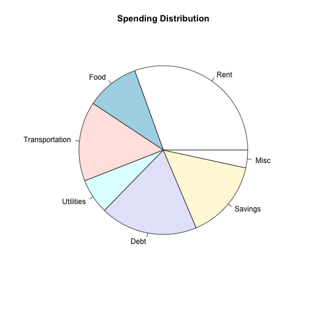

## Personal Finance

- Our finances make up a very large part of our life.
- However, most of us know very little about how to budget the money we earn.
- Budget Visualizer gives anyone the power to keep track of their money.

--- .class #id 

## Your Budget

- Budget Visualizer allows you to track all your expenses and income in one easy form.
- Expenses are grouped into categories such as:
    - Rent
    - Food
    - Utilities
    - etc.

--- .class #id

## Visualizing Your Money

- Budget Visualizer shows calculates the money you have left over or how much you're over spending.
- It also shows you what your spending on with a simple pie chart.

 

--- .class #id

## Organize Your Life

- Creating a budget doesn't just secures your finances, it frees you into pursuing what you love to do.
- Budget Visualizer gives you that freedom in a one-page, easy to use web application.
